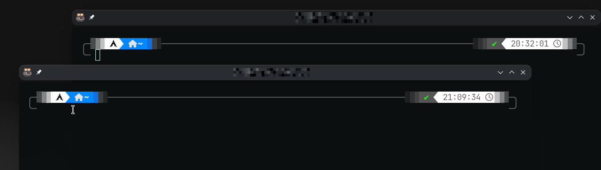

<h1 align="center">Upgrade-Your-Terminal-zsh</h1>

<div align="center">
  
  
</div>

<p align="center">
  Скрипт для быстрой настройки красивого и удобного терминала на базе <b>zsh</b> + <b>Oh My Zsh</b> с полезными плагинами и темой Powerlevel10k.
</p>

## 💿 Установка

### Debian/Ubuntu
```
sudo apt install -y zsh git curl
```

### Arch Linux
```
sudo pacman -Syu --needed zsh git curl
```

### Fedora
```
sudo dnf install -y zsh git curl
```

### Запуск скрипта
```
sh -c "$(curl -fsSL https://raw.githubusercontent.com/<username>/Upgrade-Your-Terminal-zsh/main/install.sh)"
```

Скрипт автоматически:
- устанавливает [Oh My Zsh](https://ohmyz.sh/);
- делает `zsh` оболочкой по умолчанию;
- ставит тему **Powerlevel10k** и плагины **zsh-autosuggestions** и **zsh-syntax-highlighting**;
- подключает всё в `~/.zshrc`.

## 🚀 Что вы получите

- 🎨 Тема Powerlevel10k с информативным промптом (git-статус, время, exit-код);
- ⌨️ Автодополнение команд по мере ввода;
- 🌈 Подсветка синтаксиса: верные команды — зелёным, ошибочные — красным;
- 🧩 Базовые плагины Oh My Zsh: `git`, `z`, `extract`, `sudo` и другие.

## ⚙️ Ручная настройка

1. Сменить оболочку по умолчанию:
   ```
   chsh -s $(which zsh)
   ```
2. Установить Oh My Zsh:
   ```
   sh -c "$(curl -fsSL https://raw.githubusercontent.com/ohmyzsh/ohmyzsh/master/tools/install.sh)"
   ```
3. Добавить в `~/.zshrc`:
   ```
   ZSH_THEME="powerlevel10k/powerlevel10k"
   plugins=(git z extract sudo zsh-autosuggestions zsh-syntax-highlighting)
   ```

## 📝 Требования

- Linux (Debian/Ubuntu, Arch, Fedora) или WSL2;
- `git` и `curl`;
- шрифт [MesloLGS NF](https://github.com/romkatv/powerlevel10k#meslo-nerd-fonts-installed-for-p10k) (скрипт подскажет, если его нет).

## 📄 Лицензия

MIT
